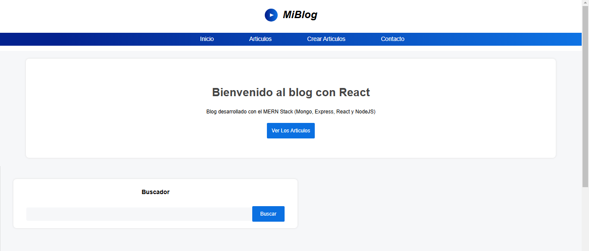
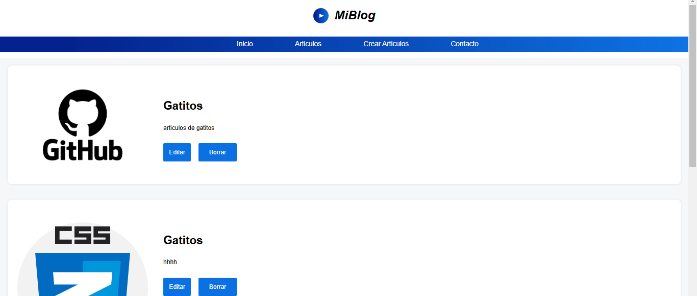
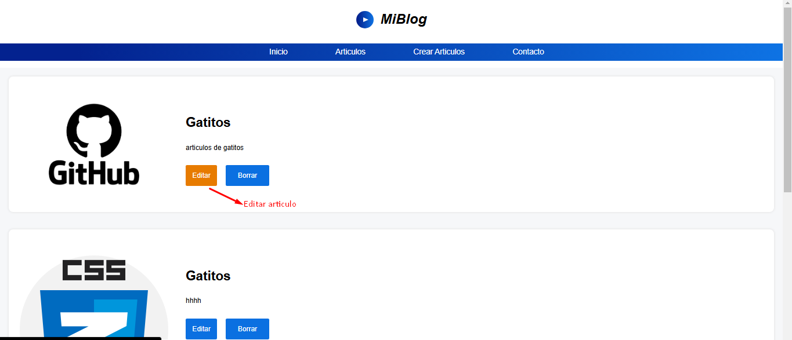
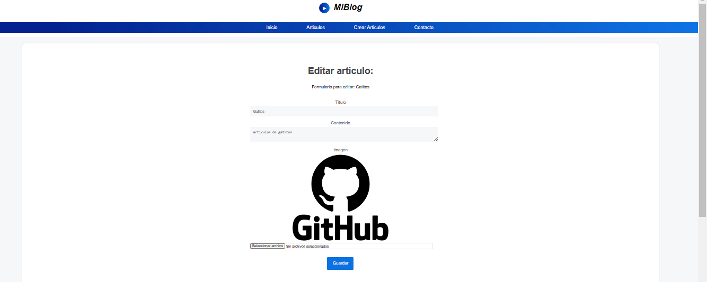
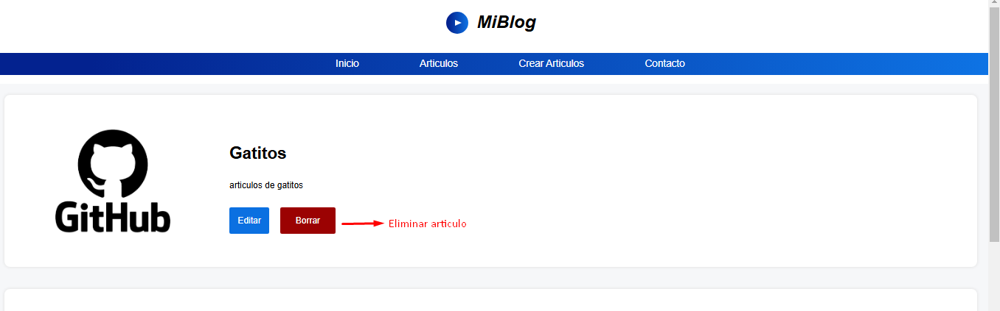
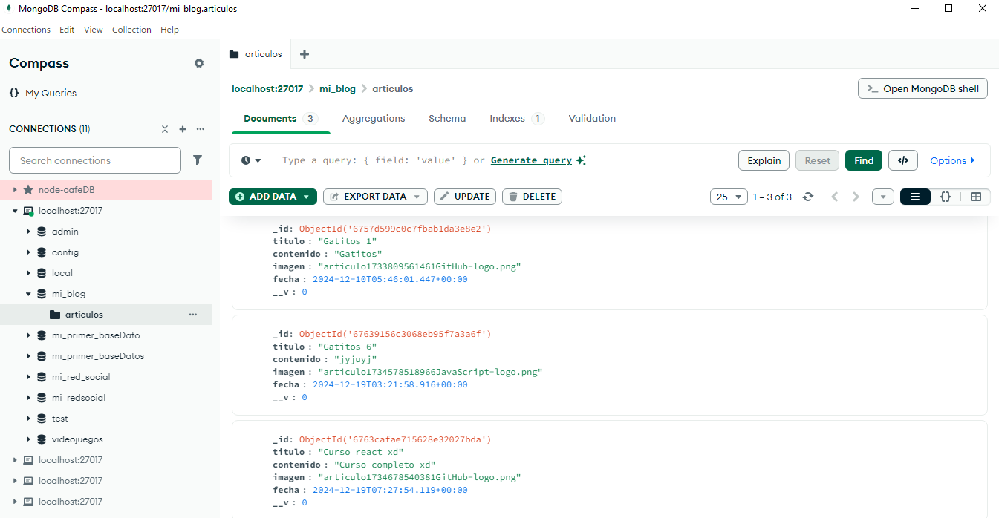
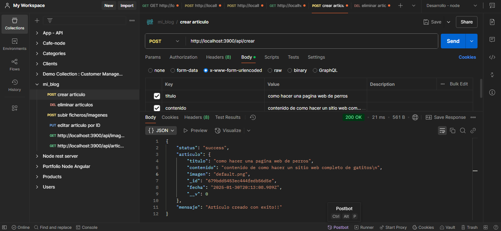
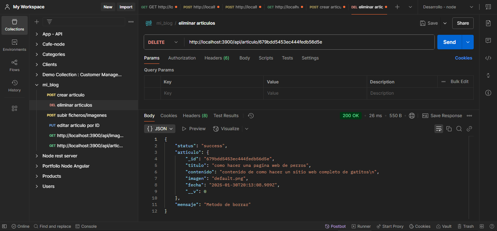

# Red Social-Backend 👥

Este backend es el núcleo de la red social, desarrollado con Node.js, Express y MongoDB. Permite almacenar en mongoDB el ID, titulo e imagen de los elementos registrados. Para probar y gestionar las solicitudes a la API, utilice Postman.

## Tabla de Contenidos

- [Características](#caracteristicas)
- [Tecnologías](#tecnologias)
- [Instalación](#instalacion)
- [Interfaz](#interfaz)
- [Despliegue](#despliegue)
- [Contacto](#contacto)

## Características 💬 <a id="caracteristicas"></a>

- **Gestión de archivos:**
  Permite subir y almacenar imágenes utilizando Multer. 🔃

- **Base de datos con MongoDB:**
  Guarda información como ID, título e imagen de los elementos registrados. 📥

- **CRUD completo:**
  Funcionalidades para crear, leer, actualizar y eliminar registros. 📄

- **API REST con Express:**
  Backend ligero y eficiente para gestionar solicitudes HTTP. 🚀

- **Validación de datos:**
  Implementada con Validator para mejorar la seguridad. 🔒

- **CORS habilitado:**
  Permite solicitudes desde distintos orígenes. 📬

- **Pruebas con Postman:**
  Todas las rutas fueron testeadas y optimizadas con Postman. 🔀

- **Renderizado dinámico con Pug:**
  Motor de plantillas para generar vistas desde el backend. 🌄

## Tecnologías 🌐 <a id="tecnologias"></a>

- **Express**: Framework para la creación del servidor y gestión de rutas.
- **Multer**: Middleware para la carga y gestión de imágenes.
- **Mongoose (Schema y Model)**: Modelado y almacenamiento de datos en MongoDB.
- **Validator**: Validación de datos para mayor seguridad.
- **CORS**: Middleware para habilitar solicitudes entre distintos dominios.
- **Pug**: Motor de plantillas para la generación de vistas dinámicas.
- **Postman:**: Herramienta para probar y depurar las rutas de la API.

## Instalación ⚙️ <a id="instalacion"></a>

Antes de instalar, descargue e instale Node.js.☑️

1. Clona el repositorio:

```bash
  git clone https://github.com/freya-godoy/Red-Social-Backend.git
```

2. Instala dependencias del proyecto:

```sh
npm install
```

## Interfaz 📲 <a id="interfaz"></a>

Inicio del blog 📰



Articulos 📄



Editar articulo 📝 





Eliminar articulo  🚮



## Base de datos con MongoDB 📲 <a id="interfaz"></a>

Articulos 📰



## Pruebas API con Postman 🔧 <a id="interfaz"></a>

Articulo creado ✔️



Eliminar articulo 🚮



## Despliegue 📂 <a id="despliegue"></a>

Despliegue desde la consola:

Backend

```sh
npm start
```

Frontend

```sh
npm run dev
```

## Contribuciones 👇

¡Las contribuciones son bienvenidas! Sigue estos pasos:

1. Haz un fork del repositorio.
2. Crea una rama nueva: `git checkout -b nueva-rama`.
3. Realiza tus cambios y haz un commit: `git commit -m "Descripción"`.
4. Sube los cambios: `git push origin nueva-rama`.
5. Abre un Pull Request.

## Contacto 📬 <a id="contacto"></a>

- Email: freya.godoy.20@hotmail.com


